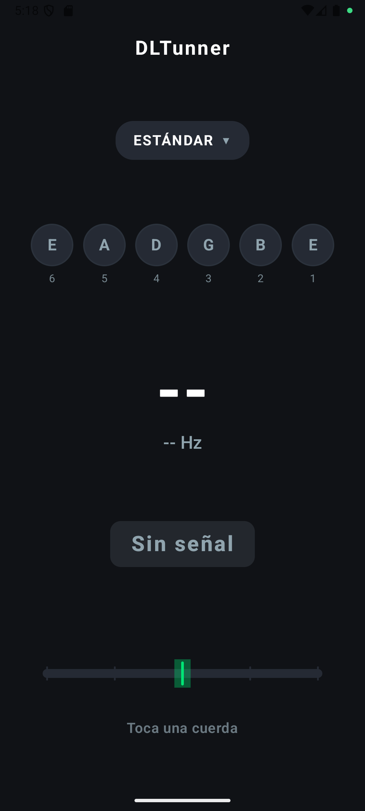

# DLTunner

DLTunner is a Kotlin-based Android guitar tuner app built with Jetpack Compose. It listens to your guitar through the microphone, detects the active string and pitch, and gives live feedback to help you tune accurately.

<p align="center">
  
</p>

## Features

- Real-time guitar tuning using microphone input
- Support for multiple guitar tunings:
  - Standard
  - Drop D
  - Eb Standard
  - D Standard
- String detection and pitch analysis
- Visual cents meter and tuning status indicators
- Material 3 UI with a modern Android experience
- Splash screen and microphone permission flow

## App Overview

This project is an Android application that analyzes live audio input and estimates the fundamental frequency of the note being played. The detected pitch is compared against the selected string target, and the app shows whether the note is sharp, flat, or in tune.

## Tech Stack

- Kotlin
- Android Jetpack Compose
- Material 3
- AndroidX Core KTX
- Lifecycle ViewModel
- Android microphone audio capture
- Pitch detection based on a YIN-inspired approach

## Project Structure

```text
DLTunner/
├── app/
│   ├── src/
│   │   ├── main/
│   │   │   ├── java/com/darthleonard/dltunner/
│   │   │   │   ├── core/
│   │   │   │   ├── data/
│   │   │   │   ├── domain/
│   │   │   │   ├── presentation/
│   │   │   │   └── ui/
│   │   │   ├── res/
│   │   │   └── AndroidManifest.xml
│   │   ├── test/
│   │   └── androidTest/
│   └── build.gradle.kts
├── gradle/
├── screenshots/
├── .gitignore
├── build.gradle.kts
├── gradle.properties
├── gradlew
├── gradlew.bat
├── settings.gradle.kts
├── README.md
└── LICENSE (if added later)
```

## Getting Started

### Prerequisites

- Android Studio
- JDK 11 or newer
- Android SDK configured for the project
- A physical Android device or emulator with microphone support

### Run the app

1. Clone the repository:

```bash
git clone https://github.com/darthleonard/DLTunner.git
cd DLTunner
```

2. Open the project in Android Studio.

3. Let Gradle sync and download required dependencies.

4. Select an emulator or connected device.

5. Run the app.

6. When prompted, allow microphone permission.

## How It Works

The app listens to microphone input, analyzes the waveform in the pitch detection layer, and estimates the frequency of the currently played note. The detected pitch is then compared to the selected tuning target and displayed as:

- current note frequency
- cents offset from the target
- whether the string is too low, too high, or in tune
- the selected string state within the tuning layout

## Tuning Presets

The app includes several common guitar tuning presets:

- Standard
- Drop D
- Eb Standard
- D Standard

These are defined in `app/src/main/java/com/darthleonard/dltunner/data/tuning/TuningPresets.kt`.

## License

DLTunner is licensed under the **GNU General Public License v3.0 (GPL-3.0)**.

See the [LICENSE](LICENSE) file for the complete license text.

## Contributing

Contributions are welcome. If you want to improve the tuner, add more tuning presets, refine pitch detection, or polish the UI, feel free to open an issue or submit a pull request.

## Contact

Repository owner: `darthleonard`

Project: `darthleonard/DLTunner`
